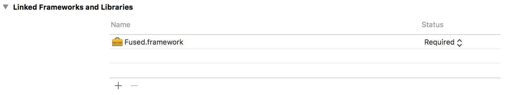
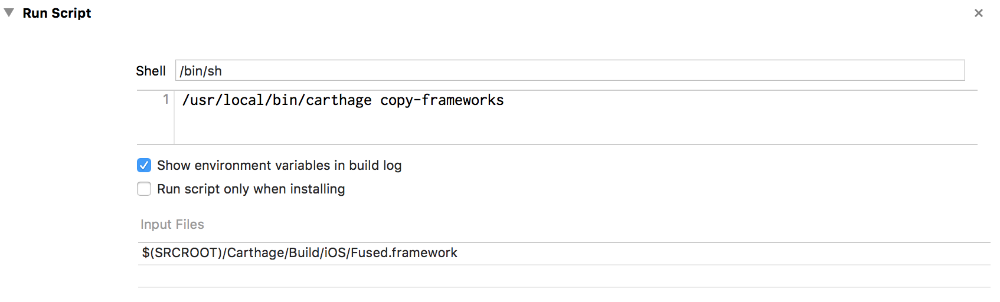

# Fused

[](https://raw.githubusercontent.com/softwarenerd/Fused/master/LICENSE.md)  [](https://github.com/Carthage/Carthage)

[Fused](https://github.com/softwarenerd/Fused) is an iOS Framework that contains Objective-C ports of MadgwickAHRS and MahonyAHRS. The original C implementations of MadgwickAHRS and MahonyAHRS can be found [here](http://www.x-io.co.uk/res/sw/madgwick_algorithm_c.zip).

## Getting Started

Fused should be used via [Carthage dependency manager](https://github.com/Carthage/Carthage). Follow the [Carthage build instructions](https://github.com/Carthage/Carthage#if-youre-building-for-ios-tvos-or-watchos) for building for iOS. Essentially:

#### Add Fused to your Cartfile

```github "softwarenerd/Fused"```

#### Add Fused.framework to Linked Frameworks and Libraries



#### Add Copy Frameworks Run Script

Add a run script that uses the ```carthage copy-frameworks``` command to copy the ```Fused.framework``` 



## Usage

See [CoreMotionTestDriver](https://raw.githubusercontent.com/softwarenerd/Fused/master/Fused/CoreMotionTestDriver.m) for a sample of how to use Fused. 

## RawIMU Sample App

The [RawIMU](https://github.com/softwarenerd/RawIMU) project contains a sample app that uses Fused.

#### Clone Raw IMU

`~/Code git clone git@github.com:softwarenerd/RawIMU.git`

#### Optionally, Build Carthage Dependencies

```~/Code/RawIMU carthage bootstrap```

## Known Issues

* Additional unit tests would be nice.

## License

Fused is released under the [GNU General Public License](LICENSE.md).